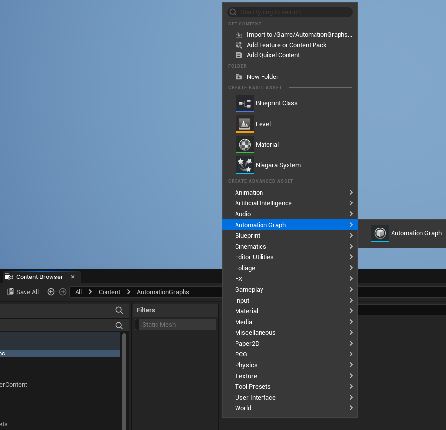
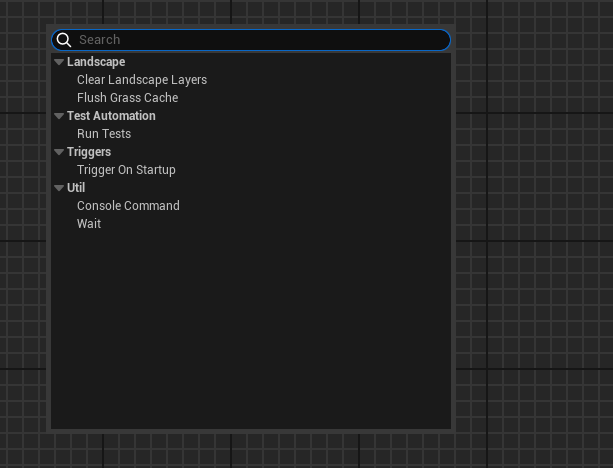
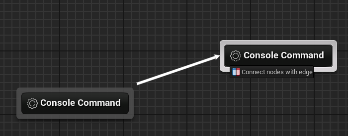
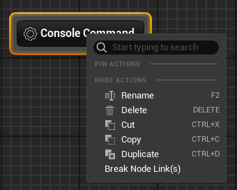
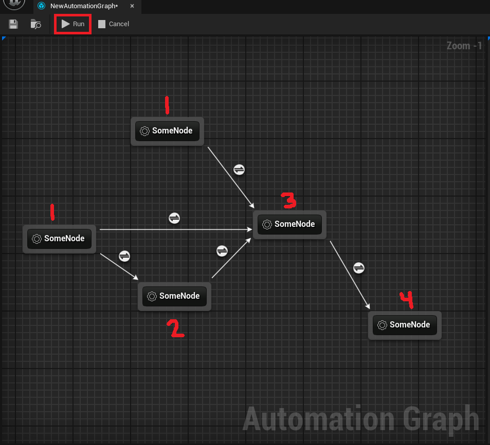
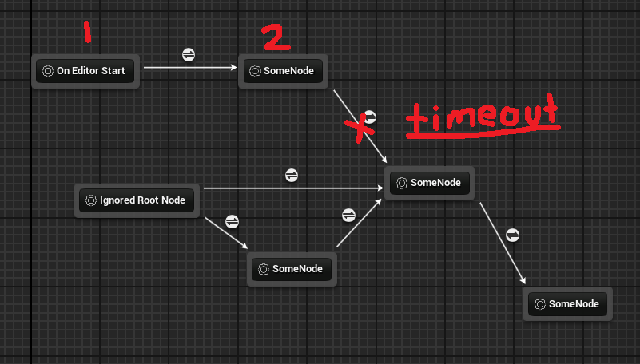

# Automation Graph

Author: Mason Stevenson

[https://masonstevenson.dev](https://masonstevenson.dev/)

<br>

AutomationGraph is a framework for defining sequences of Unreal Engine actions and various triggers to execute these sequences. It is a more generalized spin-off of an earlier project of mine, the Houdini Build Sequence Graph (see my [EnhancedHoudiniEngine](https://github.com/masonstevenson-dev/EnhancedHoudiniEngine) repo). My main motivation for creating this was that I wanted an easy way to trigger certain actions on editor start, such as running unit tests.


The system is pretty bare bones at the moment. This documentation will give you the necessary information to create your own nodes and triggers if you wish to expand the base functionality with your own custom automation actions.

<br>

## Required Plugins

This plugin uses my [AnankeCore](https://github.com/masonstevenson-dev/AnankeCore) plugin for logging. You can either install that plugin, or revert the logging back to standard UE logging by flipping the `bUseAnankeLogging` flag to false in `AutomationGraphRuntime.Build.cs` and `AutomationGraphEditor.Build.cs`.

<br>

## Installation

Install this plugin in your project's plugins folder. The folder structure should be: `YourProject/Plugins/AutomationGraph/AutomationGraph/Source`.


The plugin is enabled by default.

<br>

## Usage

Once the plugin is installed, you should see a new "AutomationGraph" asset type when you right click in the content browser.

  


Once you've created an automation graph, you can right click the empty graph to add nodes:

 


 and you can left click+drag from the edge of one node to another to create connections between nodes:

 


You can also:

* Rename
* Delete
* Cut/Copy/Paste
* Duplicate

by right clicking on a node, or using the associated hotkey.

 


Once you have your graph set up, you can click the play button at the top of the graph to run it. Graph nodes run in [topological](https://en.wikipedia.org/wiki/Topological_sorting) order, meaning that a node will not start running until all the previous nodes connected to it have run. Nodes with the same in-degree will run concurrently.




In addition to normal execution node, you can also define trigger nodes. Currently the only supported trigger node is "On Editor Start", which will cause your graph to run when the UE editor starts. At editor startup, only the "On Editor Start" root nodes are enqueued. So if there are other nodes in your graph that have both an editor start and a non editor start node as a parent, the graph will time out after executing as many nodes as it can. 



<br>

## Defining Your Own Custom Nodes

To define your own custom node, simply create a node that subclasses UAutomationGraphUserNode (note: you technically could also subclass UCoreAutomationGraphNode- currently the only difference is what icon the node has when you spawn it). Your node will automatically be registered with the AutomationGraph system.

```c++
#pragma once
#include "Foundation/AutomationGraphNode.h"

#include "YourCustomNode.generated.h"

// DisplayName controls the name for your node that appears when you right click to pull up the list of
// available nodes to create.
UCLASS(meta=( DisplayName="MyNode" ))
class UAGN_YourCustomNode : public UAutomationGraphUserNode
{
	GENERATED_BODY()

public:
	UAGN_YourCustomNode(const FObjectInitializer& Initializer);

    // This is the category your node will be grouped with when you right click to pull up the list of
    // available nodes to create.
	virtual FText GetNodeCategory() override { return return FText::FromString(TEXT("MyNodeCategory")); }

    // You can define your own node settings like this:
	UPROPERTY(EditAnywhere, BlueprintReadWrite)
	bool bSomeBooleanSetting = false;
    
    UPROPERTY(EditAnywhere, BlueprintReadWrite)
	float SomeFloatSetting = 0.5f;

protected:
    // This is the "tick" function for automation graph nodes.
	virtual EAutomationGraphNodeState ActivateInternal(float DeltaSeconds) override;
};
```


Put whatever node logic you want inside your ActivateInternal implementation. This function will continue to tick until the node has finished or timed out.

```c++
#include "AutomationNodes/Wait.h"

UAGN_YourCustomNode::UAGN_YourCustomNode(const FObjectInitializer& Initializer): Super(Initializer)
{
    // This is the text that will appear in the edit field when you first create a node.
	Title = FText::FromString("Wait");
    
    // Default is 300.0 (5 minutes). Add this if you want to change from the default
    NodeTimeoutSec = 60.0f; // 1 minute
}

EAutomationGraphNodeState UAGN_YourCustomNode::ActivateInternal(float DeltaSeconds)
{
	// Standard activation, ensures the node is active past this block.
	{
		EAutomationGraphNodeState CurrentState = GetState();
		if (CurrentState == EAutomationGraphNodeState::Standby)
		{
			return SetState(EAutomationGraphNodeState::Active);
		}
		if (CurrentState != EAutomationGraphNodeState::Active)
		{
			return CurrentState;
		}
	}
    
    bool bSuccess = DoSomeWork();

	if (!bSuccess)
	{
		return SetState(EAutomationGraphNodeState::Error);
	}
    
    bool bIsFinished = DoSomeOtherWork();

	if (bIsFinished)
	{
		return SetState(EAutomationGraphNodeState::Finished);
	}

	return EAutomationGraphNodeState::Active;
}
```

<br>

## Known Issues

* ctrl+z while inside an Automation Graph is currently unsupported and may crash the editor.

<br>